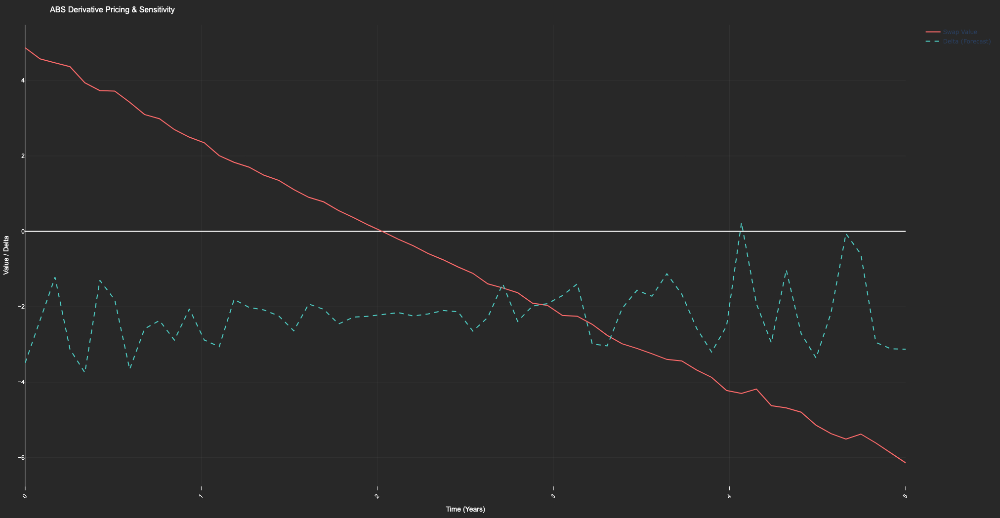

# abs_derivative_pricing_tool

- This Python tool prices derivatives (e.g., interest rate swaps or options) tied to an Asset-Backed Security (ABS) portfolio.
- It calculates fair values and sensitivities (e.g., delta) for hedging purposes.
- The tool uses Monte Carlo simulations for pricing and visualizes results with Plotly.

---

## Files
- `abs_derivative_pricing_tool.py`: Main script for pricing ABS derivatives and calculating sensitivities.
- `abs_derivative_results.csv`: Output dataset containing time, swap values, and delta sensitivities.
- `output.png`: Plot.

---

## Libraries Used
- `numpy`
- `pandas`
- `plotly.graph_objects`
- `scipy`

---

## Timeframe
- **Input**: Synthetic ABS portfolio data over a 5-year horizon (60 time steps).
- **Output**: Fair values and sensitivities (e.g., delta) for the derivative across the time horizon.

## Screenshots

